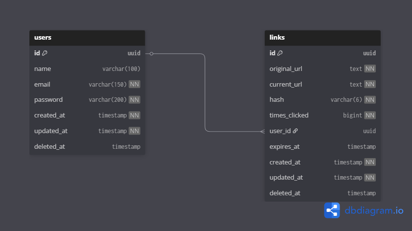

# Node URL Shortener 🔗

Um encurtador de URLs robusto e escalável desenvolvido em Node.js com NestJS, TypeScript e Redis. O projeto oferece uma solução completa para criar, gerenciar e rastrear links encurtados com suporte para autenticação de usuários, expiração de links e contagem de acessos.

## 📋 Descrição do Projeto

Este aplicativo permite converter links longos em endereços curtos e fáceis de compartilhar, com funcionalidades avançadas:

- **Encurtamento de URLs**: Criação de links curtos únicos usando [nanoid](https://github.com/ai/nanoid)
- **Redirecionamento automático**: Acesso ao link original através do hash curto
- **Sistema de autenticação**: JWT para gerenciamento seguro de usuários
- **Gestão de links**: Usuários autenticados podem listar, atualizar e deletar seus links
- **Expiração programada**: Links podem ter data de expiração configurável
- **Contagem de cliques**: Registro de cada acesso aos links via Redis
- **Validação rigorosa**: Uso extensivo de [Zod](https://github.com/colinhacks/zod) para validação de schemas em múltiplas camadas (DTOs, controllers, usecases)
- **Cobertura de testes**: Suite completa de testes unitários e E2E

## 🔧 Tecnologias e Versões

O projeto utiliza versões específicas para garantir compatibilidade e estabilidade:

| Tecnologia | Versão | Descrição |
|------------|--------|-----------|
| **Node.js** | 24.11.1 | Runtime JavaScript |
| **NestJS** | 11.x | Framework web progressivo |
| **TypeScript** | 5.7.3 | Linguagem tipada |
| **PostgreSQL** | latest | Banco de dados relacional |
| **Redis** | latest | Cache e contador de cliques |
| **TypeORM** | 0.3.27 | ORM para TypeScript |
| **Zod** | 4.1.12 | Validação de schemas |
| **pnpm** | latest | Gerenciador de pacotes |

> ⚠️ **Importante**: O projeto utiliza Node.js 24.11.1 conforme especificado no [Dockerfile](./Dockerfile). Recomenda-se usar a mesma versão para desenvolvimento local.

## ✅ Validações e Qualidade

O projeto implementa validação em múltiplas camadas:

- **DTOs**: Validação de entrada usando schemas Zod em [`src/link/link.schema.ts`](./src/link/link.schema.ts) e [`src/user/user.schema.ts`](./src/user/user.schema.ts)
- **Pipes customizados**: [`ZodValidationPipe`](./src/common/pipes/zod-validation.pipe.ts) para validação automática
- **Guards**: Proteção de rotas com [`AuthGuard`](./src/auth/guards/auth.guard.ts)
- **Interceptors**: Tratamento de requisições com [`SetLoggedUserOnRequestInterceptor`](./src/auth/interceptors/set-logged-user-on-request.interceptor.ts)
- **Exception filters**: [`ZodExceptionFilter`](./src/common/filters/zod-exception.filter.ts) para tratamento de erros

### 🧪 Testes

O projeto possui cobertura abrangente de testes:

```bash
# Testes unitários
pnpm test

# Testes com cobertura
pnpm test:cov

# Testes E2E
pnpm test:e2e

# Testes em watch mode
pnpm test:watch
```

**Resultados dos testes**: Todos os testes estão passando ✅

Arquivos de teste incluem:
- Testes unitários: `*.spec.ts` em cada módulo
- Testes E2E: [`test/auth.e2e-spec.ts`](./test/auth.e2e-spec.ts), [`test/link.e2e-spec.ts`](./test/link.e2e-spec.ts), [`test/user.e2e-spec.ts`](./test/user.e2e-spec.ts)

## 📊 Diagrama do Banco de Dados



O banco de dados utiliza PostgreSQL com as seguintes entidades principais:
- **users**: Gerenciamento de usuários
- **links**: Armazenamento de URLs encurtadas

## 🌐 Links Úteis

- **📝 Documentação Swagger**: Disponível em `api/docs` quando o servidor estiver rodando
- **📮 Collection Postman**: [docs/Url Shortener.postman_collection.json](./docs/Url_Shortener.postman_collection.json)

## 🚀 Instruções de Instalação

### Pré-requisitos

- Node.js 24.11.1 (ou compatível)
- pnpm (gerenciador de pacotes)
- Docker e Docker Compose (opcional, para ambiente containerizado)

### 1️⃣ Clonar o Repositório

```bash
git clone https://github.com/MatheusFerreira71/node_url_shortener.git
cd node_url_shortener
```

### 2️⃣ Configurar Variáveis de Ambiente

Crie um arquivo `.env` na raiz do projeto baseado no [`.env.example`](./.env.example):

```bash
# Windows PowerShell
Copy-Item .env.example .env

# Linux/Mac
cp .env.example .env
```

Edite o arquivo `.env` com suas configurações:

```env
# Configurações gerais da aplicação
PORT=3000
NODE_ENV=development
BASE_URL=http://localhost:3000

# Configurações do banco de dados PostgreSQL
DB_HOST=localhost
DB_PORT=5432
DB_USER=your_username
DB_PASS=your_password
DB_NAME=your_database

# Configurações do Redis
REDIS_HOST=localhost
REDIS_PORT=6379

# Chave secreta para JWT (mínimo 32 caracteres)
JWT_SECRET_KEY=your-jwt-secret-key-here

# Número de rounds para o bcrypt (padrão: 10)
BCRYPT_SALT_ROUNDS=10
```

### 3️⃣ Opção A: Instalação com Docker Compose (Recomendado)

```bash
docker compose up -d --build
```

Isso irá:
- Construir a imagem da aplicação
- Iniciar containers PostgreSQL, Redis e a aplicação
- Expor a aplicação na porta configurada (padrão: 3000)

### 3️⃣ Opção B: Instalação Local

1. Instale as dependências:

```bash
pnpm install
```

2. Inicie a aplicação:

```bash
# Modo desenvolvimento
pnpm start:dev

# Modo produção
pnpm build
pnpm start:prod
```

### 4️⃣ Verificar Instalação

Acesse:
- **Health check**: http://localhost:3000/health/http
  - Existem outros endpoints de health check
- **Documentação Swagger**: http://localhost:3000/api/docs

## 📚 Scripts Disponíveis

```bash
# Desenvolvimento
pnpm start:dev          # Inicia em modo watch
pnpm start:debug        # Inicia com debug

# Build e Produção
pnpm build              # Compila o projeto
pnpm start:prod         # Inicia em modo produção

# Qualidade de Código
pnpm lint               # Executa linter
pnpm format             # Formata código
pnpm quality:ci         # Verificação CI

# Testes
pnpm test               # Testes unitários
pnpm test:e2e           # Testes end-to-end
pnpm test:cov           # Testes com cobertura

# Banco de Dados
pnpm migration:create   # Cria nova migration
```

## 🔮 Melhorias Futuras

O projeto possui diversas oportunidades de evolução:

### 🏗️ Arquitetura e Design

- **Princípios SOLID**: Refatorar alguns módulos para melhor aderência aos princípios SOLID
  - Aplicar mais Dependency Inversion em alguns services
  - Criar abstrações (interfaces) para dependências externas
  - Separar melhor as responsabilidades em alguns use cases

### 📊 Observabilidade e Monitoramento

- **Métricas**: Integração com Datadog, New Relic ou Prometheus
  - Monitoramento de performance (latência, throughput)
  - Alertas de erro e disponibilidade
  - Dashboards customizados
- **Logging estruturado**: Implementar Winston ou Pino para logs mais robustos, ou implementar uma versão mais completa do logger do Nest
- **Tracing distribuído**: OpenTelemetry para rastreamento de requisições

### ⚡ Escalabilidade

- **Redis Cluster**: Escalonamento horizontal do sistema de contagem de cliques
  - Distribuição de carga entre múltiplos nós Redis
  - Alta disponibilidade com replicação
  - Melhor performance para alto volume de acessos
  
- **Containerização em escala**: Deploy com AWS ECS ou Kubernetes
  - Auto-scaling baseado em métricas
  - Load balancing automático
  - Rolling updates sem downtime
  - Configuração já existente em [`Docker-compose.yml`](./Docker-compose.yml) facilita migração

### 🎯 Funcionalidades

- **Sistema de usuários robusto**:
  - Recuperação de senha via email
  - Verificação de email
  - Perfis de usuário com avatares
  - Autenticação OAuth (Google, GitHub)
  
- **Gestão avançada de links**:
  - Links personalizados (vanity URLs)
  - QR Codes automáticos
  - Analytics detalhados (geolocalização, dispositivos, referrers)
  - Tags e categorização de links
  - Proteção por senha

- **Modelo SaaS**:
  - Planos freemium/premium
  - Limitação de links por plano
  - Cobrança via Stripe/PayPal
  - Dashboard de analytics premium
  - API para desenvolvedores

### 🚧 Desafios Técnicos das Melhorias

#### 1. Redis Cluster
**Desafios**:
- **Consistência de dados**: Em um cluster distribuído, manter contadores sincronizados é complexo
- **Sharding**: Definir estratégia de particionamento de dados (por hash? por usuário?)
- **Network partitioning**: Lidar com split-brain e recuperação de falhas
- **Custo**: Múltiplos nós aumentam infraestrutura e custos operacionais

**Soluções**:
- Usar Redis Cluster nativo com slot hashing
- Implementar CRDTs (Conflict-free Replicated Data Types) para contadores
- Eventual consistency para métricas não-críticas

#### 2. Escalabilidade Horizontal com ECS/Kubernetes
**Desafios**:
- **Session management**: JWT já resolve, mas Redis sessions requerem sticky sessions ou session store compartilhado
- **Database connections**: Pool de conexões precisa ser otimizado para múltiplas instâncias
- **Migrations**: Coordenar migrações de banco entre deployments
- **Health checks**: Garantir que containers não recebam tráfego antes de estarem prontos

**Soluções**:
- Usar RDS Proxy ou PgBouncer para connection pooling
- Implementar migration locks (TypeORM suporta)
- Readiness/liveness probes bem configurados

#### 3. Métricas e Observabilidade
**Desafios**:
- **Performance overhead**: Coleta de métricas pode impactar latência
- **Custo de armazenamento**: Logs e traces ocupam muito espaço
- **Correlação**: Rastrear requests através de múltiplos serviços
- **Privacidade**: GDPR/LGPD ao coletar dados de usuários

**Soluções**:
- Sampling estratégico (não loggar tudo)
- Agregação de métricas antes de enviar
- Trace IDs propagados via headers
- Anonimização de dados sensíveis

#### 4. Sistema SaaS
**Desafios**:
- **Multi-tenancy**: Isolar dados de clientes (schema por tenant? row-level security?)
- **Billing complexo**: Metered billing requer tracking preciso
- **Rate limiting**: Por usuário, por IP, por plano?
- **Downgrade handling**: O que fazer com dados ao downgrade de plano?

**Soluções**:
- PostgreSQL Row-Level Security para isolamento
- Jobs agendados para calcular uso mensal
- Redis para rate limiting distribuído
- Soft-delete e archive de dados

#### 5. Analytics Avançados
**Desafios**:
- **Volume de dados**: Milhões de clicks geram muitos dados
- **Geolocalização**: Requer base de dados IP-to-location (GeoIP2)
- **Real-time vs Batch**: Balance entre dashboards em tempo real e processamento em lote
- **Aggregations**: Consultas complexas podem sobrecarregar DB principal

**Soluções**:
- Data warehouse separado (ClickHouse, TimescaleDB)
- ETL assíncrono com queues (Bull/BullMQ)
- CQRS para separar reads de writes
- Materialização de views para queries frequentes

## 📄 Licença

Este projeto está sob a licença MIT. Veja o arquivo [LICENSE](./LICENSE) para mais detalhes.

## 👤 Autor

**Matheus Ferreira**

---

Desenvolvido com ❤️ usando NestJS
